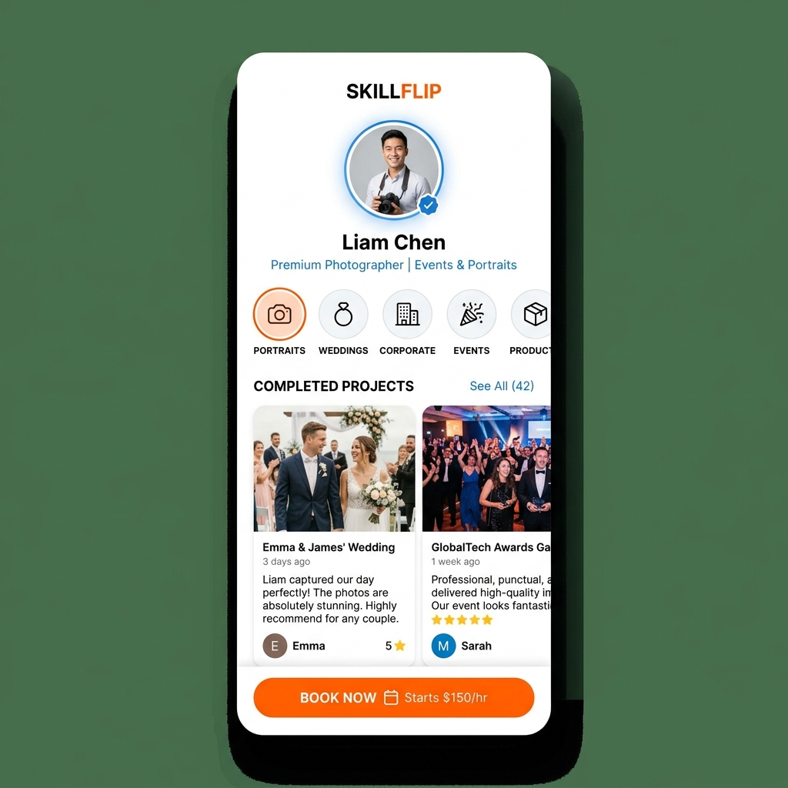
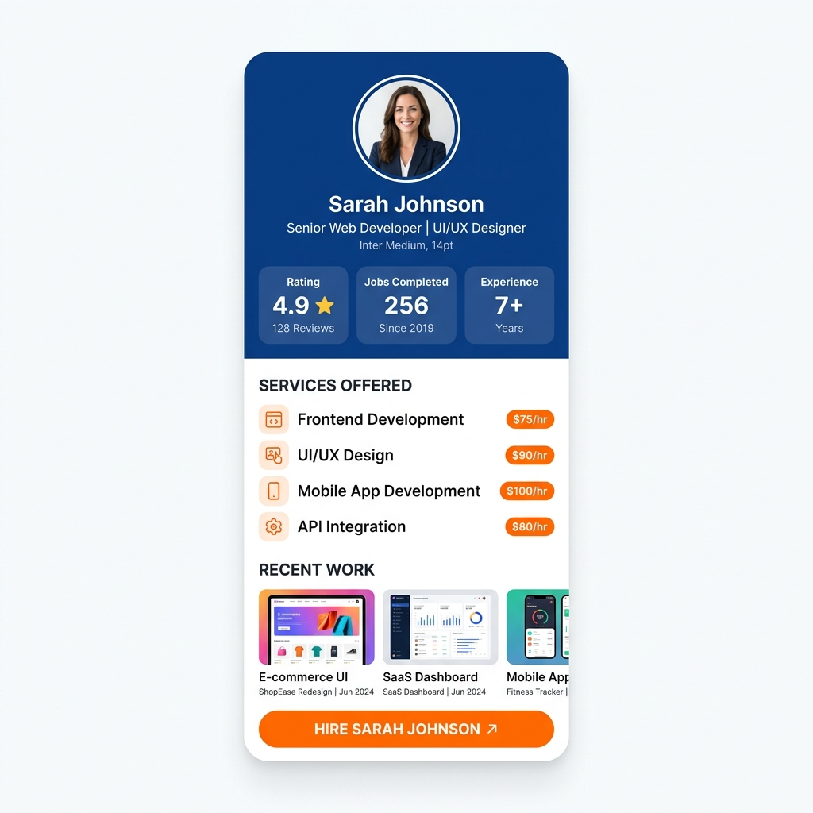
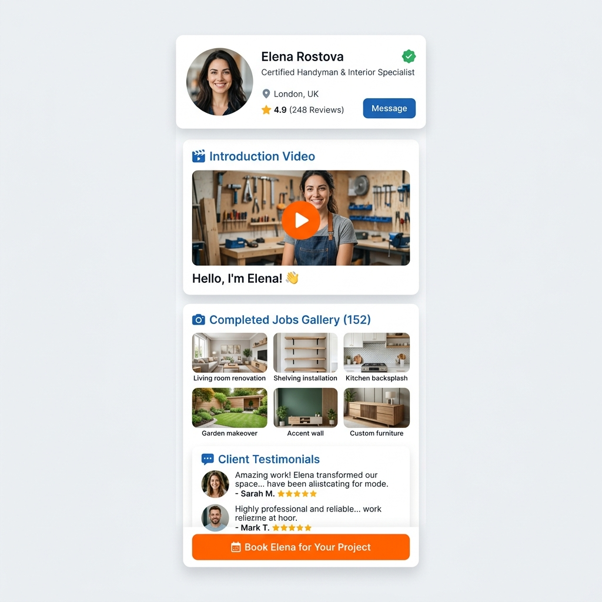

# EPIC: Perfiles Dinámicos Multitema para Profesionales

## Descripción de la Funcionalidad
A partir de ahora, **los profesionales podrán elegir entre 3 "Plantillas" o "Temas" visuales** para mostrar su perfil público. Además, necesitamos diferenciar estrictamente lo que ve el profesional de lo que ve el cliente.

---

## 1. Actualización de Base de Datos (Backend)
* Añadir un campo en el esquema del Profesional (ej. `profileTheme`) que acepte tres valores: `'social'`, `'corporate'`, y `'modular'`. (Por defecto `'social'`).
* Añadir soporte para un campo de video: `presentationVideoUrl`.

## 2. Vista del Profesional (Modo Edición/Preview)
* **Ruta:** Cuando el usuario en *Modo Profesional* toca el botón **"PERFIL"**.
* **Requisito:** Aquí el profesional debe poder ver un selector visual para elegir su tema preferido (Social, Corporativo, Modular). Debe poder subir/grabar su **Video de Presentación** y previsualizar cómo se verá su perfil público.

## 3. Vista del Cliente (Modo Lectura/Informativo)
* **Ruta:** Cuando el usuario en *Modo Cliente* está en la página de su Solicitud, un profesional lo contacta y el cliente toca **"Ver Perfil"**.
* **Reglas Estrictas de UI:**
  * Esta vista es un Modal (o pantalla superpuesta) puramente informativo.
  * **Botón de Cierre:** Debe existir una **"X" clara en la esquina superior derecha** para que el cliente pueda cerrar el perfil.
  * **CERO Botones de Acción:** Queda estrictamente prohibido incluir botones de "Chatear", "Contactar", "Llamar" o "Solicitar Cotización" dentro de esta vista del perfil.

---

## 4. Diseño de los 3 Temas (Mockups)

### Tema 1: Social
Diseño tipo red social. Foto de perfil grande y centrada. Servicios mostrados en íconos circulares. Feed vertical de trabajos realizados, donde las reseñas aparecen integradas debajo de cada foto.

### Tema 2: Corporativo (Data-Driven)
Diseño que impone autoridad. Cabecera azul oscuro con la foto y 3 bloques de estadísticas gigantes (Rating, Trabajos Completados, Años de Experiencia). Lista limpia de servicios y slider horizontal de trabajos.

### Tema 3: Modular (Con Video)
Diseño basado en tarjetas flotantes. Contiene una tarjeta dedicada exclusivamente a reproducir el **Video de Presentación**, muro de fotos de trabajos y reseñas separadas.

